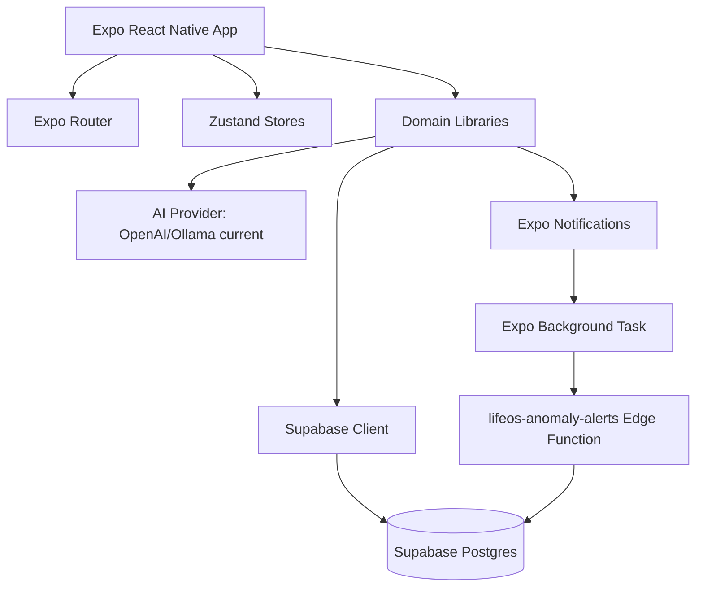
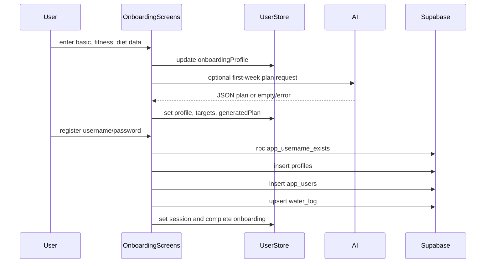
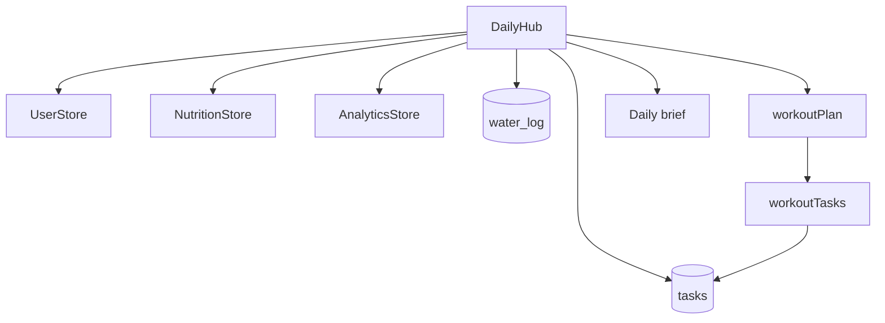
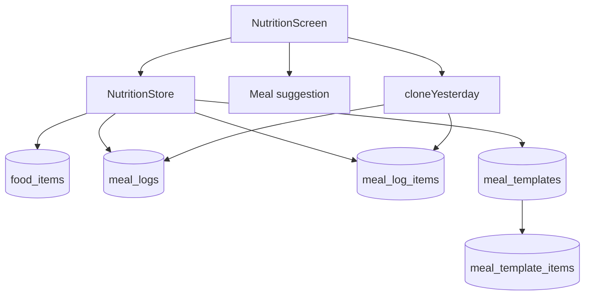
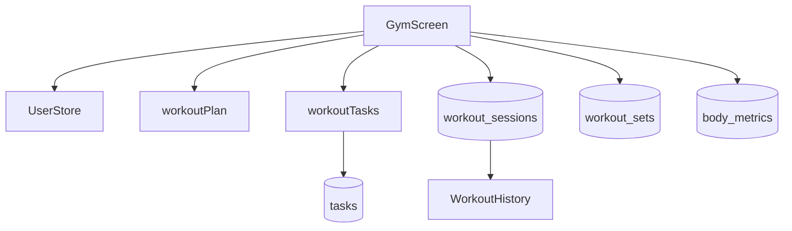
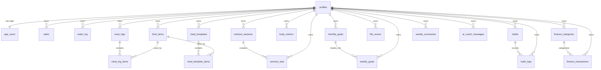

# LifeOS Architecture

## 1. Architecture Purpose

This document translates `docs/prd.md` and the current repository into a technical architecture for upgrading LifeOS safely.

LifeOS is currently a React Native + Expo Router app with Supabase persistence, Zustand local state, custom username/password login, OpenAI/Ollama AI integration, local notifications, background anomaly checks, and a partially complete Supabase schema surface.

This architecture has three jobs:

- Show how the project is structured today.
- Define the target technical shape for a clean upgrade.
- Document every Supabase table, relationship, and missing migration needed to make the app reliable from a clean database.

## 2. Current Architecture Summary

### Runtime Stack

| Layer | Current technology |
| --- | --- |
| Mobile app | React Native `0.85.3`, React `19.2.3`, Expo `~56.0.11` |
| Routing | Expo Router `~56.2.10` |
| State | Zustand with AsyncStorage persistence |
| Backend client | `@supabase/supabase-js` |
| Database | Supabase Postgres |
| Background logic | Supabase Edge Function, Expo Background Fetch, Expo Task Manager |
| Notifications | Expo Notifications |
| Local security | Expo Local Authentication |
| Charts/visuals | Victory Native, React Native SVG, Reanimated, Skia |
| AI | OpenAI `gpt-4o-mini` when configured, local Ollama fallback when enabled |

### High-Level System



## 3. Repository Folder Structure

Current top-level project folders:

```text
LifeOS/
  app/
    (onboarding)/
    (tabs)/
    +html.tsx
    +not-found.tsx
    _layout.tsx
    ai-coach.tsx
    finance.tsx
    workout-history.tsx
  components/
    layout/
    ui/
    *.tsx
  constants/
  docs/
    prd.md
    architecture.md
  lib/
  stores/
  supabase/
    functions/
      lifeos-anomaly-alerts/
    migrations/
  types/
  assets/
  _bmad/
  .agents/
  package.json
  app.json
  tsconfig.json
```

### `app/`

Expo Router route tree.

```text
app/
  _layout.tsx
    Root stack, session redirects, app lock, notification handler, background task registration.

  (onboarding)/
    _layout.tsx
    index.tsx              Welcome
    login.tsx              Custom login
    basic-profile.tsx      Name, gender, age, height
    fitness-profile.tsx    Goal, experience, gym days, weight target
    diet-profile.tsx       Cuisines, foods, disliked foods, meal timing, AI toggle
    plan-reveal.tsx        TDEE/macros/water/workout plan generation
    register.tsx           Profile and app_users persistence

  (tabs)/
    _layout.tsx            Seven-tab layout
    index.tsx              Daily Hub
    nutrition.tsx          Nutrition logging
    gym.tsx                Gym session execution
    goals.tsx              Weekly/monthly/finance combined UI
    analytics.tsx          Performance charts
    habits.tsx             Habit tracker
    settings.tsx           Notifications, AI model, lock, backup, logout

  ai-coach.tsx             Modal AI coach
  workout-history.tsx      Gym session history
  finance.tsx              Placeholder
```

Architecture direction:

- Keep route files as screen composition only.
- Move Supabase data loading and writes into `lib/<domain>.ts` service modules as screens stabilize.
- Keep `(tabs)/goals.tsx` as the combined weekly/monthly/finance screen until product confirms a standalone Finance route.

### `components/`

Reusable UI.

```text
components/
  layout/
    BottomNav.tsx
    ScreenHeader.tsx
  ui/
    DomainBadge.tsx
    HeatmapCalendar.tsx
    LifeOSButton.tsx
    LifeOSCard.tsx
    MacroBar.tsx
    ProgressRing.tsx
    StatCard.tsx
    TimelineItem.tsx
  Themed.tsx
  StyledText.tsx
```

Architecture direction:

- Keep these presentational.
- Do not add Supabase, navigation, or business logic to `components/ui`.
- Shared domain widgets that need data should live in `components/<domain>/` only after at least three screens need them.

### `lib/`

Domain and infrastructure utilities.

```text
lib/
  ai.ts               AI provider adapter and prompt helpers
  calculations.ts     TDEE, macros, Life Score, streak helpers
  cloneYesterday.ts   Meal clone workflow
  design.ts           Design tokens
  notifications.ts    Expo notification scheduling and background task registration
  password.ts         Username normalization and password hashing
  profile.ts          Profile payload/row mapping
  supabase.ts         Supabase client
  waterLog.ts         Water upsert behavior
  workoutPlan.ts      Generated/fallback workout plan shaping
  workoutTasks.ts     Daily workout task creation/completion
```

Architecture direction:

- Add service modules for missing domains:
  - `lib/nutritionService.ts`
  - `lib/gymService.ts`
  - `lib/goalsService.ts`
  - `lib/habitsService.ts`
  - `lib/analyticsService.ts`
  - `lib/financeService.ts`
- Keep `lib/ai.ts` as provider adapter plus small prompt helpers, not screen-specific business logic.

### `stores/`

Zustand state.

```text
stores/
  useUserStore.ts
  useNutritionStore.ts
  useGymStore.ts
  useGoalsStore.ts
  useAnalyticsStore.ts
  useHabitsStore.ts
  useAICoachStore.ts
  useSettingsStore.ts
```

Architecture direction:

- Stores should hold UI/session state and locally cached state.
- Supabase writes can stay inside stores short term, but upgrade target is service modules called by stores or screens.
- Persist only state that is required after app restart.
- Avoid persisting derived analytics that can be recomputed or loaded.

### `supabase/`

Database and edge functions.

```text
supabase/
  migrations/
    202606120001_onboarding_accounts.sql
    202606130001_fix_water_log_user_date_constraint.sql
    202606130002_app_users_auth.sql
    202606130003_tasks_client_access.sql
    202606130004_profiles_gender.sql
    202606130005_tasks_user_scope.sql
    202606130006_dedupe_workout_tasks.sql
    202606130007_workout_history_access.sql
  functions/
    lifeos-anomaly-alerts/
      index.ts
```

Architecture direction:

- Add creation migrations for every table referenced by code.
- Add owner-scoped RLS after auth model is chosen.
- Treat `types/database.ts` as generated output after migrations are correct, not as the schema source.

## 4. Navigation Architecture

### Root Layout Responsibilities

File: `app/_layout.tsx`

Responsibilities:

- Load fonts and hide splash.
- Redirect unauthenticated users to onboarding/login.
- Redirect authenticated users away from onboarding.
- Register notification response handler.
- Register background anomaly task.
- Enforce app lock with local authentication.
- Define root stack routes.

Target rule:

- Root layout should stay orchestration-only. Avoid domain data loading here.

### Tab Layout Responsibilities

File: `app/(tabs)/_layout.tsx`

Tabs:

- `index` -> Daily Hub
- `nutrition` -> Diet
- `gym` -> Gym
- `goals` -> Goals
- `analytics` -> Analytics
- `habits` -> Habits
- `settings` -> Settings

Target rule:

- Tab layout owns navigation chrome only. Screens own data needs.

## 5. State Architecture

### Store Ownership

| Store | Owns | Persisted |
| --- | --- | --- |
| `useUserStore` | session id, profile, onboarding draft, calorie/macros/water targets, generated plan, preferences | Yes |
| `useNutritionStore` | current daily meals, food operations, templates, water ml | No explicit persist |
| `useGymStore` | current split, active session shell, PR map, streak | No explicit persist |
| `useGoalsStore` | lightweight weekly/monthly goal arrays | No explicit persist |
| `useAnalyticsStore` | current Life Score and placeholder trends | No explicit persist |
| `useHabitsStore` | local habit toggle shell | No explicit persist |
| `useAICoachStore` | recent AI coach messages | Uses AsyncStorage and Supabase |
| `useSettingsStore` | notification settings, quiet hours, AI model, app lock | Yes |

### Upgrade Rule

Use this boundary:

- Store: "What does the UI need right now?"
- Service: "How do we read/write domain data?"
- Library: "How do we transform/calculate data?"
- Screen: "How do we present and compose interactions?"

Example target:

```text
NutritionScreen
  -> useNutritionStore
  -> nutritionService
  -> supabase
```

## 6. Data Flow Architecture

### Onboarding And Account Creation



### Daily Hub



### Nutrition



### Gym



## 7. Supabase Schema Architecture

### Schema Principle

`profiles.id` is the app-level user id for the current custom auth model. Every user-owned table should include `user_id uuid not null references public.profiles(id) on delete cascade`.

If the project migrates to Supabase Auth, use `auth.users.id` as the owner id and either:

- Make `profiles.id` equal `auth.users.id`, or
- Add `profiles.auth_user_id` and enforce joins carefully.

Do not mix custom `profiles.id` ownership with `supabase.auth.getUser().id` ownership inside domain tables.

### Table Inventory

This inventory includes all tables listed in `types/database.ts`, all tables created/altered by migrations, and all tables referenced by code.

| Table | Status | Owner | Purpose |
| --- | --- | --- | --- |
| `profiles` | Created | Self | User profile, onboarding, targets, generated plan |
| `app_users` | Created | `profile_id` | Custom app login credentials |
| `tasks` | Created | `user_id` | Daily tasks and generated workout tasks |
| `food_items` | Missing creation migration | `user_id` nullable or required | Food database and custom foods |
| `meal_logs` | Missing creation migration | `user_id` | Meal header by date/type |
| `meal_log_items` | Missing creation migration | Via `meal_log_id`, optional direct `user_id` | Foods logged under a meal |
| `meal_templates` | Missing creation migration | `user_id` | Reusable meals |
| `meal_template_items` | Missing creation migration | Via `meal_template_id` | Foods under templates |
| `workout_sessions` | Altered only | `user_id` | Completed workout sessions |
| `workout_sets` | Altered only | `user_id` plus session FK | Exercise set history |
| `body_metrics` | Altered only | `user_id` | Weight/body metrics |
| `water_log` | Created | `user_id` | Daily hydration |
| `weekly_goals` | Missing creation migration | `user_id` | Weekly execution goals |
| `monthly_goals` | Missing creation migration | `user_id` | Monthly goal planning |
| `habits` | Missing creation migration | `user_id` | Habit definitions |
| `habit_logs` | Missing creation migration | `user_id` plus `habit_id` | Habit completions |
| `life_scores` | Missing creation migration | `user_id` | Daily score snapshots |
| `learning_books` | Type only / retired UI | `user_id` | Previous reading tracker, not used by current app screens |
| `learning_courses` | Type only / retired UI | `user_id` | Previous course tracker, not used by current app screens |
| `finance_transactions` | Missing creation migration | `user_id` | Spending tracker |
| `finance_categories` | Missing creation migration | `user_id` | Finance categories and budgets |
| `weekly_summaries` | Missing creation migration | `user_id` | Weekly AI/data rollup |
| `ai_coach_messages` | Missing creation migration | `user_id` | Persisted AI chat messages |

## 8. Table Contracts And Relationships

### 8.1 `profiles`

Purpose:

- Canonical user profile for custom auth model.
- Stores onboarding state, nutrition targets, workout split, generated first-week plan, food preferences, and app-level profile settings.

Key columns from migrations/code:

- `id uuid primary key default gen_random_uuid()`
- `username text unique`
- `name text`
- `gender text`
- `age integer`
- `height_cm integer`
- `weight_kg numeric`
- `target_weight_kg numeric`
- `gym_days_per_week integer`
- `split text`
- `workout_split text`
- `currency text default 'INR'`
- `measurements text default 'metric'`
- `goal text`
- `fitness_goal text`
- `experience_level text`
- `cuisine_prefs jsonb default '[]'`
- `foods_to_avoid jsonb default '[]'`
- `foods_eaten jsonb default '[]'`
- `foods_avoided jsonb default '[]'`
- `first_meal_time text`
- `last_meal_time text`
- `ai_calc_calories boolean default true`
- `ai_model text default 'openai'`
- `calorie_goal integer`
- `protein_goal_g integer`
- `carbs_goal_g integer`
- `fat_goal_g integer`
- `macros jsonb default '{}'`
- `daily_water_goal_ml integer`
- `water_target_ml integer`
- `first_week_plan jsonb default '{}'`
- `onboarding_profile jsonb default '{}'`
- `onboarding_completed boolean default false`
- `created_at timestamptz default now()`
- `updated_at timestamptz default now()`

Relationships:

- One `profiles` row has one `app_users` row.
- One `profiles` row has many rows in all user-owned domain tables.

Upgrade requirements:

- Add `updated_at` trigger.
- Choose whether `username` belongs in `profiles`, `app_users`, or both.
- Do not store password data in `profiles`.

### 8.2 `app_users`

Purpose:

- Custom credential table.

Key columns:

- `id uuid primary key default gen_random_uuid()`
- `username text not null unique`
- `password_hash text not null`
- `profile_id uuid not null unique references public.profiles(id) on delete cascade`
- `created_at timestamptz default now()`

Relationships:

- `app_users.profile_id -> profiles.id`

Functions:

- `app_username_exists(input_username text) returns boolean`
- `verify_app_login(input_username text, input_password_hash text) returns table(profile_id uuid)`

Upgrade decision:

- Recommended long-term: migrate to Supabase Auth.
- If keeping custom auth: RLS cannot use `auth.uid()` for owner scoping unless a secure session model is added. Treat anon-wide policies as development-only.

### 8.3 `tasks`

Purpose:

- General daily tasks and generated workout tasks.

Key columns:

- `id uuid primary key default gen_random_uuid()`
- `user_id uuid references public.profiles(id) on delete cascade`
- `title text not null`
- `date date not null`
- `time_block text`
- `completed boolean default false`
- `priority text default 'medium'`
- `category text`
- `notes text`
- `created_at timestamptz default now()`

Indexes/constraints:

- `tasks_user_date_idx (user_id, date)`
- `tasks_unique_daily_workout (user_id, date, lower(title)) where category = 'fitness'`

Relationships:

- `tasks.user_id -> profiles.id`
- Generated workout task links logically to today's workout template by title/category, not by FK.

Upgrade requirements:

- Add `updated_at`.
- Add optional `source_type`, `source_id`, `due_time`, `notification_id` if task reminders need lifecycle tracking.

### 8.4 `food_items`

Purpose:

- Global or user-created foods used for search and meal logging.

Target columns:

- `id uuid primary key default gen_random_uuid()`
- `user_id uuid references public.profiles(id) on delete cascade null`
- `name text not null`
- `serving text`
- `unit text`
- `calories numeric not null default 0`
- `protein numeric not null default 0`
- `carbs numeric not null default 0`
- `fat numeric not null default 0`
- `created_at timestamptz default now()`
- `updated_at timestamptz default now()`

Relationships:

- `meal_log_items.food_item_id -> food_items.id`
- `meal_template_items.food_item_id -> food_items.id`

RLS:

- Read global foods where `user_id is null`.
- Read/write own foods where `user_id = current profile id`.

### 8.5 `meal_logs`

Purpose:

- Meal header for a user/date/meal type.

Target columns:

- `id uuid primary key default gen_random_uuid()`
- `user_id uuid not null references public.profiles(id) on delete cascade`
- `date date not null`
- `meal_type text not null check (meal_type in ('breakfast','lunch','dinner','snack'))`
- `name text`
- `time text`
- `calories numeric default 0`
- `protein numeric default 0`
- `carbs numeric default 0`
- `fat numeric default 0`
- `created_at timestamptz default now()`
- `updated_at timestamptz default now()`

Relationships:

- `meal_logs.user_id -> profiles.id`
- `meal_log_items.meal_log_id -> meal_logs.id`

Constraints:

- Recommended unique: `(user_id, date, meal_type)`.

Important code gap:

- `useNutritionStore.getOrCreateMealLog` currently queries by `date` and `meal_type` only, without `user_id`. Upgrade this before multi-user use.

### 8.6 `meal_log_items`

Purpose:

- Individual food entries inside a meal.

Target columns:

- `id uuid primary key default gen_random_uuid()`
- `meal_log_id uuid not null references public.meal_logs(id) on delete cascade`
- `food_item_id uuid references public.food_items(id) on delete set null`
- `name text`
- `serving text`
- `qty numeric not null default 1`
- `quantity numeric`
- `calories numeric default 0`
- `protein numeric default 0`
- `carbs numeric default 0`
- `fat numeric default 0`
- `created_at timestamptz default now()`

Relationships:

- `meal_log_items.meal_log_id -> meal_logs.id`
- `meal_log_items.food_item_id -> food_items.id`

Upgrade requirements:

- Add denormalized nutrient values as stored snapshot, because food definitions can change later.
- RLS via parent `meal_logs.user_id`.

### 8.7 `meal_templates`

Purpose:

- Reusable meals.

Target columns:

- `id uuid primary key default gen_random_uuid()`
- `user_id uuid references public.profiles(id) on delete cascade null`
- `name text not null`
- `meal_type text check (meal_type in ('breakfast','lunch','dinner','snack'))`
- `calories numeric default 0`
- `protein numeric default 0`
- `carbs numeric default 0`
- `fat numeric default 0`
- `created_at timestamptz default now()`
- `updated_at timestamptz default now()`

Relationships:

- `meal_templates.user_id -> profiles.id`
- `meal_template_items.meal_template_id -> meal_templates.id`

RLS:

- Same global-or-owned pattern as `food_items`.

### 8.8 `meal_template_items`

Purpose:

- Food rows inside reusable templates.

Target columns:

- `id uuid primary key default gen_random_uuid()`
- `meal_template_id uuid not null references public.meal_templates(id) on delete cascade`
- `food_item_id uuid references public.food_items(id) on delete set null`
- `name text`
- `serving text`
- `qty numeric default 1`
- `quantity numeric`
- `calories numeric default 0`
- `protein numeric default 0`
- `carbs numeric default 0`
- `fat numeric default 0`
- `created_at timestamptz default now()`

Relationships:

- `meal_template_items.meal_template_id -> meal_templates.id`
- `meal_template_items.food_item_id -> food_items.id`

### 8.9 `workout_sessions`

Purpose:

- Completed workout summary.

Target columns based on code:

- `id uuid primary key default gen_random_uuid()`
- `user_id uuid not null references public.profiles(id) on delete cascade`
- `date date not null`
- `template_name text`
- `name text`
- `muscle_groups text[] default '{}'`
- `started_at timestamptz`
- `completed_at timestamptz`
- `duration_minutes integer default 0`
- `total_volume_kg numeric default 0`
- `total_sets integer default 0`
- `notes text`
- `created_at timestamptz default now()`
- `updated_at timestamptz default now()`

Relationships:

- `workout_sessions.user_id -> profiles.id`
- `workout_sets.session_id -> workout_sessions.id`

Indexes:

- `(user_id, completed_at desc)`
- `(user_id, date, template_name)`

### 8.10 `workout_sets`

Purpose:

- Exercise set history.

Target columns based on code:

- `id uuid primary key default gen_random_uuid()`
- `user_id uuid not null references public.profiles(id) on delete cascade`
- `session_id uuid not null references public.workout_sessions(id) on delete cascade`
- `exercise_name text not null`
- `muscle_group text`
- `set_number integer`
- `weight_kg numeric default 0`
- `reps integer default 0`
- `is_personal_record boolean default false`
- `completed boolean default true`
- `rest_seconds integer`
- `created_at timestamptz default now()`

Relationships:

- `workout_sets.user_id -> profiles.id`
- `workout_sets.session_id -> workout_sessions.id`

Critical upgrade decision:

- Standardize on `session_id`. Current PRD notes uncertainty with `workout_session_id`, but current Gym code writes `session_id`. Migrations must create that FK and nested Supabase selects must use it.

### 8.11 `body_metrics`

Purpose:

- Body weight and measurement history.

Target columns:

- `id uuid primary key default gen_random_uuid()`
- `user_id uuid not null references public.profiles(id) on delete cascade`
- `date date not null`
- `weight_kg numeric`
- `waist_cm numeric`
- `chest_cm numeric`
- `arm_cm numeric`
- `notes text`
- `created_at timestamptz default now()`

Relationships:

- `body_metrics.user_id -> profiles.id`

Constraints:

- Recommended unique: `(user_id, date)`.

### 8.12 `water_log`

Purpose:

- Daily hydration state.

Implemented columns:

- `id uuid primary key default gen_random_uuid()`
- `user_id uuid references public.profiles(id) on delete cascade`
- `date date not null default current_date`
- `glasses integer default 0`
- `goal integer default 8`
- `amount_ml integer default 0`
- `target_ml integer`
- `created_at timestamptz default now()`

Relationships:

- `water_log.user_id -> profiles.id`

Constraints:

- `water_log_user_date_key unique (user_id, date)`

Upgrade requirements:

- Make `user_id` not null after existing data is cleaned.
- Add owner-scoped RLS.

### 8.13 `weekly_goals`

Purpose:

- Week-level goals used in Goals and AI Coach.

Target columns based on code:

- `id uuid primary key default gen_random_uuid()`
- `user_id uuid not null references public.profiles(id) on delete cascade`
- `monthly_goal_id uuid references public.monthly_goals(id) on delete set null`
- `title text not null`
- `category text default 'work'`
- `current numeric default 0`
- `progress_current numeric default 0`
- `completed numeric default 0`
- `target numeric default 1`
- `target_value numeric default 1`
- `unit text default 'items'`
- `week_start date`
- `status text`
- `created_at timestamptz default now()`
- `updated_at timestamptz default now()`

Relationships:

- `weekly_goals.user_id -> profiles.id`
- `weekly_goals.monthly_goal_id -> monthly_goals.id`

### 8.14 `monthly_goals`

Purpose:

- Month-level goals that can be broken into weekly goals.

Target columns:

- `id uuid primary key default gen_random_uuid()`
- `user_id uuid not null references public.profiles(id) on delete cascade`
- `title text not null`
- `progress numeric default 0`
- `progress_percent numeric default 0`
- `milestones jsonb default '[]'`
- `status text`
- `month date`
- `created_at timestamptz default now()`
- `updated_at timestamptz default now()`

Relationships:

- `monthly_goals.user_id -> profiles.id`
- `weekly_goals.monthly_goal_id -> monthly_goals.id`

### 8.15 `habits`

Purpose:

- Habit definitions.

Target columns based on Habits screen:

- `id uuid primary key default gen_random_uuid()`
- `user_id uuid not null references public.profiles(id) on delete cascade`
- `name text not null`
- `title text`
- `frequency text default 'daily'`
- `frequency_type text default 'daily'`
- `frequency_count integer default 7`
- `times_per_week integer`
- `category text`
- `routine text`
- `stack text`
- `reminder_time text`
- `rest_day text`
- `rest_days text`
- `created_at timestamptz default now()`
- `updated_at timestamptz default now()`

Relationships:

- `habits.user_id -> profiles.id`
- `habit_logs.habit_id -> habits.id`

Upgrade requirements:

- Stop using `supabase.auth.getUser()` unless the app migrates to Supabase Auth.

### 8.16 `habit_logs`

Purpose:

- Habit completion records.

Target columns:

- `id uuid primary key default gen_random_uuid()`
- `user_id uuid not null references public.profiles(id) on delete cascade`
- `habit_id uuid not null references public.habits(id) on delete cascade`
- `habit_name text`
- `name text`
- `date date not null`
- `log_date date`
- `completed_at timestamptz`
- `logged_at timestamptz default now()`
- `last_logged_at timestamptz`
- `created_at timestamptz default now()`

Relationships:

- `habit_logs.user_id -> profiles.id`
- `habit_logs.habit_id -> habits.id`

Constraints:

- Recommended unique: `(habit_id, date)`.

### 8.17 `life_scores`

Purpose:

- Daily cross-domain score snapshots.

Target columns:

- `id uuid primary key default gen_random_uuid()`
- `user_id uuid not null references public.profiles(id) on delete cascade`
- `date date not null`
- `score numeric`
- `life_score numeric`
- `value numeric`
- `total_score numeric`
- `nutrition_score numeric`
- `fitness_score numeric`
- `productivity_score numeric`
- `habits_score numeric`
- `alignment_score numeric`
- `finance_score numeric`
- `created_at timestamptz default now()`

Relationships:

- `life_scores.user_id -> profiles.id`

Constraints:

- Recommended unique: `(user_id, date)`.

### 8.18 `learning_books` Retired Type

Purpose:

- Previous reading tracker type surface.
- The Goals Learning tab and standalone Learning route have been removed, so this table is not part of the active app contract.

Target columns:

- `id uuid primary key default gen_random_uuid()`
- `user_id uuid not null references public.profiles(id) on delete cascade`
- `title text not null`
- `author text`
- `status text default 'want to read'`
- `progress numeric default 0`
- `progress_percent numeric default 0`
- `pages_read integer`
- `total_pages integer`
- `created_at timestamptz default now()`
- `updated_at timestamptz default now()`

Relationships:

- `learning_books.user_id -> profiles.id`

### 8.19 `learning_courses` Retired Type

Purpose:

- Previous course tracker type surface.
- The Goals Learning tab and standalone Learning route have been removed, so this table is not part of the active app contract.

Target columns:

- `id uuid primary key default gen_random_uuid()`
- `user_id uuid not null references public.profiles(id) on delete cascade`
- `title text not null`
- `provider text`
- `progress numeric default 0`
- `progress_percent numeric default 0`
- `minutes_today integer default 0`
- `daily_minutes integer default 0`
- `created_at timestamptz default now()`
- `updated_at timestamptz default now()`

Relationships:

- `learning_courses.user_id -> profiles.id`

### 8.20 `finance_categories`

Purpose:

- Spending categories and budgets.

Target columns:

- `id uuid primary key default gen_random_uuid()`
- `user_id uuid references public.profiles(id) on delete cascade null`
- `name text not null`
- `monthly_budget numeric default 0`
- `color text`
- `icon text`
- `created_at timestamptz default now()`
- `updated_at timestamptz default now()`

Relationships:

- `finance_transactions.finance_category_id -> finance_categories.id`

RLS:

- Allow global categories where `user_id is null`.
- Allow user categories where `user_id = current profile id`.

### 8.21 `finance_transactions`

Purpose:

- Spending rows used in Goals > Finance and Analytics.

Target columns based on code:

- `id uuid primary key default gen_random_uuid()`
- `user_id uuid not null references public.profiles(id) on delete cascade`
- `finance_category_id uuid references public.finance_categories(id) on delete set null`
- `title text`
- `merchant text`
- `category text`
- `amount numeric not null`
- `note text`
- `date date default current_date`
- `created_at timestamptz default now()`
- `updated_at timestamptz default now()`

Relationships:

- `finance_transactions.user_id -> profiles.id`
- `finance_transactions.finance_category_id -> finance_categories.id`

### 8.22 `weekly_summaries`

Purpose:

- Weekly rollup for reports and AI review.

Target columns:

- `id uuid primary key default gen_random_uuid()`
- `user_id uuid not null references public.profiles(id) on delete cascade`
- `week_start date not null`
- `week_end date not null`
- `summary text`
- `wins jsonb default '[]'`
- `risks jsonb default '[]'`
- `nutrition_avg numeric`
- `workout_count integer`
- `habit_completion_rate numeric`
- `life_score_avg numeric`
- `ai_model text`
- `created_at timestamptz default now()`

Relationships:

- `weekly_summaries.user_id -> profiles.id`

Constraints:

- Recommended unique: `(user_id, week_start)`.

### 8.23 `ai_coach_messages`

Purpose:

- Persist recent AI coach messages beyond AsyncStorage.

Target columns based on store behavior:

- `id text primary key`
- `user_id uuid references public.profiles(id) on delete cascade`
- `role text not null check (role in ('user','ai'))`
- `type text default 'text'`
- `text text not null`
- `payload jsonb default '{}'`
- `created_at timestamptz not null`
- `synced_at timestamptz default now()`

Relationships:

- `ai_coach_messages.user_id -> profiles.id`

Upgrade requirements:

- Current store upserts by `id`; make id type compatible with generated message ids, which are strings.

## 9. Entity Relationship Diagram



## 10. RLS And Auth Architecture

### Current State

- Custom credentials are stored in `app_users`.
- App session is local Zustand state.
- Some RLS policies allow all anon/authenticated access.
- Some code uses `currentUserId` from `useUserStore`.
- Habits code uses `supabase.auth.getUser()` for `user_id`, which does not align with custom auth.

### Target Option A: Keep Custom Auth Short Term

Use this only for local/single-user or prototype mode.

Rules:

- Every query must filter by `currentUserId`.
- Every insert must set `user_id = currentUserId`.
- RLS cannot truly enforce the local custom user without server-backed session claims.
- Do not ship sensitive multi-user production data with broad anon policies.

### Target Option B: Migrate To Supabase Auth

Recommended for real multi-user deployment.

Rules:

- Use Supabase Auth for username/email/password or phone/email login.
- Make `profiles.id = auth.users.id`, or add `profiles.auth_user_id`.
- RLS policies use `auth.uid()`.
- Remove or retire `app_users`.
- Update `useUserStore.currentUserId` from Supabase auth session.

Recommended decision:

- Move to Supabase Auth before public release.
- If speed matters first, finish schema and feature gaps with custom auth, then migrate auth before exposing real data.

## 11. AI Architecture

### Current Provider Design

File: `lib/ai.ts`

Current behavior:

- `getActiveAIModelLabel()` returns OpenAI if key exists, otherwise Ollama.
- `callAI()` uses OpenAI only when `allowOpenAI` is set.
- `callAI()` uses Ollama only when `allowLocalAI` is set.
- Calls without these options return empty string and rely on fallback UI.

### Target Provider Adapter

Create explicit provider interface:

```ts
type AIProvider = 'openai' | 'ollama' | 'gemini';

type AIRequest = {
  prompt: string;
  context?: Record<string, unknown>;
  responseFormat?: 'text' | 'json';
};

type AIResponse = {
  text: string;
  provider: AIProvider;
  model: string;
  fallbackUsed: boolean;
};
```

Architecture rules:

- One provider adapter per external provider.
- One public `callAI` facade.
- Every AI feature chooses expected output format.
- Every AI feature has deterministic fallback.
- Nutrition prompt helpers must include banned-food safety and post-response validation.

### Gemini Migration

Gemini is a product decision, not current behavior.

If migrating:

- Add `AIModel = 'gemini' | 'openai' | 'ollama'` or switch to Gemini-only.
- Add `EXPO_PUBLIC_GEMINI_API_KEY` or server-side proxy.
- Update Settings options.
- Update `profiles.ai_model` default.
- Update Plan Reveal status copy.
- Update AI Coach model badge.
- Keep OpenAI/Ollama only if explicitly supported.

## 12. Notifications And Background Architecture

Files:

- `lib/notifications.ts`
- `supabase/functions/lifeos-anomaly-alerts/index.ts`

Current behavior:

- Schedules daily and weekly local notifications.
- Schedules one-off task reminders.
- Registers background task `lifeos-ai-anomaly-alerts`.
- Invokes Supabase Edge Function for anomaly alerts.
- Routes notification taps to Expo Router paths.

Upgrade requirements:

- Persist scheduled notification ids if reminders need editing/canceling beyond task completion.
- Ensure routes in notification payloads stay valid.
- Gate background registration by platform/runtime.
- Make Edge Function data user-scoped.
- Add server-side auth or request validation for Edge Function.

## 13. Environment Configuration

Required current env vars:

```text
EXPO_PUBLIC_SUPABASE_URL
EXPO_PUBLIC_SUPABASE_ANON_KEY
EXPO_PUBLIC_OPENAI_API_KEY    optional, current OpenAI path
OPENAI_API_KEY                optional fallback, current OpenAI path
```

Potential future env vars:

```text
EXPO_PUBLIC_GEMINI_API_KEY    only if Gemini stays client-side
GEMINI_API_KEY                recommended server-side if Edge Function/proxy is added
```

Architecture rule:

- Public Expo variables are visible in the app bundle. Do not put sensitive production AI keys in the client for public distribution. Use an Edge Function proxy if protecting AI keys matters.

## 14. Migration Architecture For Upgrade

### Required Migration Order

1. Create missing core tables:
   - `food_items`
   - `meal_logs`
   - `meal_log_items`
   - `meal_templates`
   - `meal_template_items`
   - `workout_sessions`
   - `workout_sets`
   - `body_metrics`
   - `weekly_goals`
   - `monthly_goals`
   - `habits`
   - `habit_logs`
   - `life_scores`
   - `finance_categories`
   - `finance_transactions`
   - `weekly_summaries`
   - `ai_coach_messages`
2. Normalize `workout_sets.session_id` FK and update any code/type assumptions.
3. Add missing indexes and uniqueness constraints.
4. Backfill `user_id` where possible.
5. Make required `user_id` columns `not null`.
6. Add owner-scoped RLS.
7. Regenerate `types/database.ts` from Supabase schema.
8. Update app code to stop relying on fallback/demo data where persistence should exist.

### Suggested Indexes

```text
profiles(username)
app_users(username)
tasks(user_id, date)
water_log(user_id, date) unique
meal_logs(user_id, date, meal_type) unique
meal_log_items(meal_log_id)
food_items(user_id, name)
meal_templates(user_id, meal_type)
workout_sessions(user_id, completed_at desc)
workout_sessions(user_id, date, template_name)
workout_sets(user_id, created_at desc)
workout_sets(session_id)
body_metrics(user_id, date) unique
weekly_goals(user_id, week_start)
monthly_goals(user_id, month)
habits(user_id, created_at)
habit_logs(habit_id, date) unique
habit_logs(user_id, date)
life_scores(user_id, date) unique
finance_transactions(user_id, date desc)
finance_categories(user_id, name)
weekly_summaries(user_id, week_start) unique
ai_coach_messages(user_id, created_at desc)
```

## 15. Code Upgrade Plan

### Phase 1: Stabilize Schema

- Add missing migrations.
- Fix workout FK naming.
- Add table constraints and indexes.
- Regenerate database types.
- Ensure clean Supabase reset works.

### Phase 2: Align Identity

- Choose custom auth or Supabase Auth.
- Remove mixed `supabase.auth.getUser()` ownership from Habits or migrate all auth.
- Replace broad policies.
- Make all user-owned writes include owner id.

### Phase 3: Service Layer

Move database access out of large screens/stores into domain services:

```text
lib/services/
  authService.ts
  profileService.ts
  nutritionService.ts
  gymService.ts
  taskService.ts
  goalsService.ts
  habitsService.ts
  analyticsService.ts
  aiCoachService.ts
  financeService.ts
```

Keep compatibility exports if needed to avoid one giant refactor.

### Phase 4: AI Provider Cleanup

- Decide OpenAI/Ollama versus Gemini.
- Make settings, labels, profile payload, and adapter match.
- Ensure all AI calls pass explicit provider options.
- Add fallbacks and output validators.

### Phase 5: Product IA Cleanup

- Decide whether Finance is a standalone route.
- If standalone, move Goals > Finance into `app/finance.tsx`.
- If not standalone, remove the Finance root stack route to avoid a dead path.
- Learning has already been removed from the Goals tab and root stack.

### Phase 6: Analytics And Empty States

- Persist `life_scores`.
- Add weekly summary generation.
- Replace synthetic chart fallback values with labeled empty/demo states.
- Add failure UI for missing Supabase tables and network failures.

## 16. Testing Strategy

### Unit Tests Needed

- `calculateTDEE`, `calculateMacros`, `calculateLifeScore`, `calculateStreak`.
- `profileFromRow` and `buildProfilePayload`.
- `parseWeekPlan` behavior after exporting or moving parser to testable module.
- `buildWorkoutTemplates` and rest-day detection.
- `syncWaterLog` with existing and new rows.
- `ensureTodayWorkoutTask` dedupe rules.
- AI response safety for banned nutrition suggestions.

### Integration Tests Needed

- Register -> profile/app_users/water_log inserted.
- Login -> profile restored.
- Nutrition -> meal log and item creation.
- Gym -> session, sets, body metric, task completion.
- Habits -> create/log/delete under chosen auth model.
- Settings -> notification schedule validation.

### E2E Smoke Tests

- New user onboarding to Daily Hub.
- Log breakfast.
- Complete a workout.
- Add a habit and mark it done.
- Add weekly goal and finance transaction.
- Open analytics.
- Ask AI Coach with provider unavailable and verify fallback.

## 17. Architectural Decisions

### ADR-001: Keep Expo Router

Decision:

- Continue with Expo Router.

Rationale:

- Existing app structure is already route-based and clear.
- Typed routes are enabled.
- Navigation is not the current bottleneck.

### ADR-002: Supabase Is The System Of Record

Decision:

- Keep Supabase Postgres for persisted app data.

Rationale:

- Current app already uses Supabase across all domains.
- Edge Function and client SDK are already integrated.
- The main gap is schema completeness, not backend choice.

### ADR-003: Move Toward Domain Services

Decision:

- Introduce service modules gradually instead of rewriting screens immediately.

Rationale:

- Screens currently contain significant data access logic.
- Service modules improve testability and reduce breakage without forcing a large UI rewrite.

### ADR-004: Resolve Auth Before Production

Decision:

- Current custom auth is acceptable only for prototype/local use.
- Production should use Supabase Auth or another server-backed session model.

Rationale:

- RLS cannot securely enforce local Zustand session identity.
- Habits already show identity drift by using Supabase Auth in one place.

### ADR-005: AI Provider Must Be Explicit

Decision:

- Keep current provider behavior documented until product chooses migration.
- Do not silently label OpenAI/Ollama behavior as Gemini.

Rationale:

- Architecture must match implementation to avoid failed upgrades.
- Provider migration touches code, settings, env vars, profile payload, and prompts.

## 18. Implementation Readiness Checklist

Before feature expansion:

- [ ] Clean database can run all migrations.
- [ ] `types/database.ts` generated from real schema.
- [ ] All referenced tables exist.
- [ ] Workout sets FK standardized.
- [ ] All user-owned tables have `user_id`.
- [ ] Auth model chosen.
- [ ] Broad RLS policies replaced or explicitly marked development-only.
- [ ] Habits ownership aligned with app auth.
- [ ] AI provider labels and implementation match.
- [ ] Finance route decision made.
- [ ] Key flows tested on Android.

## 19. Upgrade Risks

| Risk | Impact | Mitigation |
| --- | --- | --- |
| Missing migrations | App fails on clean Supabase project | Add all creation migrations first |
| Broad RLS | User data exposure | Move to owner-scoped policies |
| Mixed auth identity | Records attach to wrong user id | Choose one auth model |
| AI provider mismatch | Confusing settings and broken expectations | Make provider explicit |
| Synthetic analytics fallback | Misleading product data | Label demo data or show empty state |
| Large screen files | Harder upgrade work | Extract services and hooks gradually |
| Client-side AI keys | Key exposure in public app | Use Edge Function proxy for production |

## 20. Final Architecture Target

Target LifeOS architecture:

```text
Expo app
  routes compose UI and interactions
  stores hold session/UI/cache state
  services own Supabase reads/writes
  lib owns calculations, mapping, AI adapter, notifications
  Supabase owns durable domain state
  Edge Functions own background/server-side jobs
```

The most important upgrade path is not a new framework. It is making the current architecture complete and consistent: schema first, auth second, service boundaries third, AI cleanup fourth.
